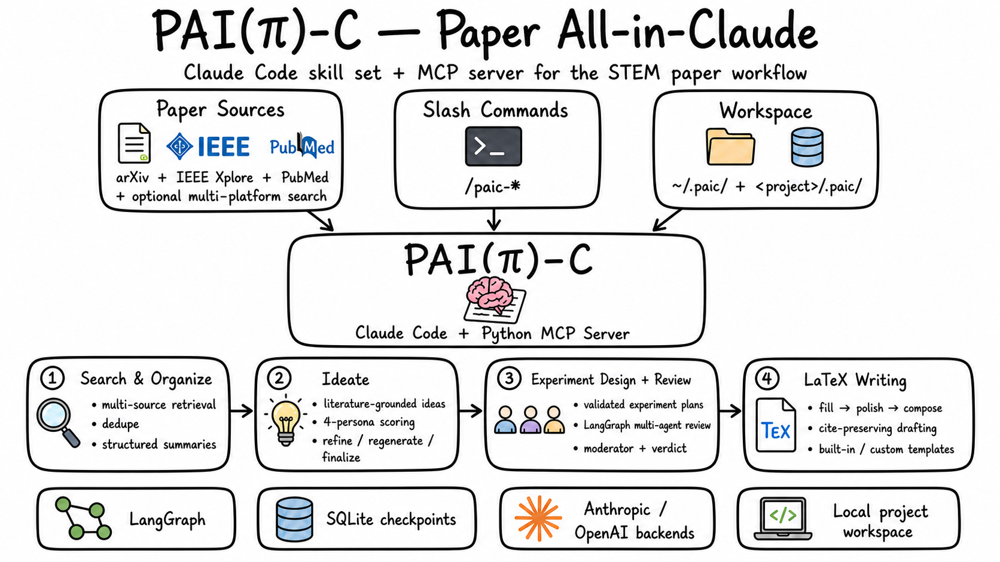

# PAI(π)-C — Paper All-in-Claude

<p align="center">
  
</p>

PAI-C runs the STEM paper workflow inside Claude Code — search and ingest literature, generate ideas, design experiments, run multi-agent reviews, and write LaTeX drafts. It ships as a set of `/paic-*` slash commands backed by a Python MCP server with LangGraph orchestration.

> **First time?** Walkthrough at [`docs/getting-started.md`](docs/getting-started.md) · full workflow at [`docs/workflow.md`](docs/workflow.md) · doc index at [`docs/`](docs/README.md).

---

## Features

- **Search & ingest** — arXiv + Semantic Scholar by default, 20+ optional platforms via `paper-search-mcp`. Title/DOI/arXiv dedupe, project-local PDF archive, structured summaries.
- **Ideate** — multi-round ideation grounded on the ingested library, scored by a 4-persona scoring panel (methodology / novelty / impact / Reviewer-2) with score memoization across rounds.
- **Experiment design + 4-persona review** — schema-validated experiment plans, then a 4-persona LangGraph review (methodology / statistics / domain / Reviewer-2) with moderator synthesis and final verdict. Personas see prior-round panel summary + author rebuttal across rounds (cross-visibility minimum patch).
- **LaTeX writing** — three-stage pipeline (`fill` / `polish` / `compose`) with built-in `cvpr` / `neurips` / `ieee` templates and per-project venue customization. Optional paragraph-mode compose (outline → write → polish) for long sections.
- **Paper-quality preflight** — `/paic-paper-plan` locks the global thesis + contribution list + per-section intent; an automatic claim ledger tracks every strong assertion with cite / experiment provenance; `/paic-finalize` runs 8 paper-level checks before submission. See [`docs/paper-plan.md`](docs/paper-plan.md) and [`docs/quality-gate.md`](docs/quality-gate.md).
- **Multi-backend routing** — 4 LLM backends (Anthropic API, Claude Agent SDK subscription, OpenAI, OpenAI-compatible relays). Each of ~20 LLM call sites is independently routable; `summarize` / `draft_polish` / `draft_compose` can run on the main Claude Code conversation via the `host` route.
- **Durable runs** — LangGraph state checkpointed to SQLite; long-running ideation and review survive across Claude Code restarts.

---

## Install

Requires Python 3.11+ and [uv](https://docs.astral.sh/uv/).

```bash
uv sync
uv run python scripts/register_mcp.py
uv run python scripts/install_skills.py
```

`register_mcp.py` adds PAI-C to `~/.claude.json` and seeds `~/.paic/config.yaml` from [`docs/config.yaml.example`](docs/config.yaml.example) on first run. `install_skills.py` copies `skills/paic-*/SKILL.md` to `~/.claude/skills/`.

---

## Configuration

PAI-C supports four auth modes — pick whichever matches what you have:

| Mode | When to use | `~/.paic/config.yaml` |
|---|---|---|
| API Key | pay-as-you-go | `providers.anthropic.mode: api_key` + env `ANTHROPIC_API_KEY` |
| Subscription | Claude Pro/Max | `providers.anthropic.mode: claude_agent_sdk` (run `claude login` first) |
| Subscription + Host | most stable for long runs | as above + `routing.overrides.summarize: host` |
| OpenAI-compatible | OpenRouter / mytoken.top / Azure / Ollama / vLLM | `providers.openai.mode: compatible` + `base_url` |

Keys are read from environment variables (`ANTHROPIC_API_KEY` / `OPENAI_API_KEY` / `SEMANTIC_SCHOLAR_API_KEY`); PAI-C never reads keys from yaml.

Full reference: [`docs/configuration.md`](docs/configuration.md). Validate with `uv run paic info` (resolved routing) and `uv run paic doctor` (health check). Troubleshooting: [`docs/troubleshooting.md`](docs/troubleshooting.md).

---

## Slash commands

| Command | Purpose |
|---|---|
| `/paic-init` | Initialize `.paic/` workspace; selects research domain when multi-platform search is enabled |
| `/paic-search <query>` | Multi-source paper search |
| `/paic-ingest <ids>` | Add papers to the project library and trigger downloads |
| `/paic-summarize [id\|all]` | Structured summaries of selected papers |
| `/paic-ideate [focus]` | Generate and score research ideas |
| `/paic-experiment <idea_id>` | Design an experiment plan |
| `/paic-paper-plan` | Lock the global paper plan: thesis, contributions, section intent, terminology |
| `/paic-review <experiment_id>` | 4-persona multi-round review; output auto-converts to a tracked revision queue |
| `/paic-draft <stage>` | LaTeX writing: `fill` / `polish` / `compose` (with optional `--mode paragraph`) |
| `/paic-figure <stage>` | Plan / generate raster figures (teaser / concept / domain), claim-bound |
| `/paic-finalize` | Paper-level preflight: 8 checks before submission |
| `/paic-resume [run_id]` | List or resume interrupted runs |
| `/paic-status` | Project overview |

Multi-platform search and venue-custom templates are documented in [`docs/external-search.md`](docs/external-search.md) and [`docs/custom-templates.md`](docs/custom-templates.md).

---

## Architecture

```
Claude Code session
  └─ /paic-* slash commands (~/.claude/skills/paic-*/SKILL.md)
       ├─ mcp__arxiv__*    (existing arXiv MCP — search, download, read, semantic_search, …)
       └─ mcp__paic__*     (this project)
            └─ LangGraph orchestration (review / ideate / experiment / writing)
                 └─ Anthropic / OpenAI APIs + Semantic Scholar + local fs
```

The workspace is hybrid: `~/.paic/` holds global config, persona templates, and the S2 cache; `<project>/.paic/` holds per-project ideas, experiments, reviews, drafts, and LangGraph checkpoints.

---

## Development

```bash
uv run pytest
uv run ruff check src tests
```
