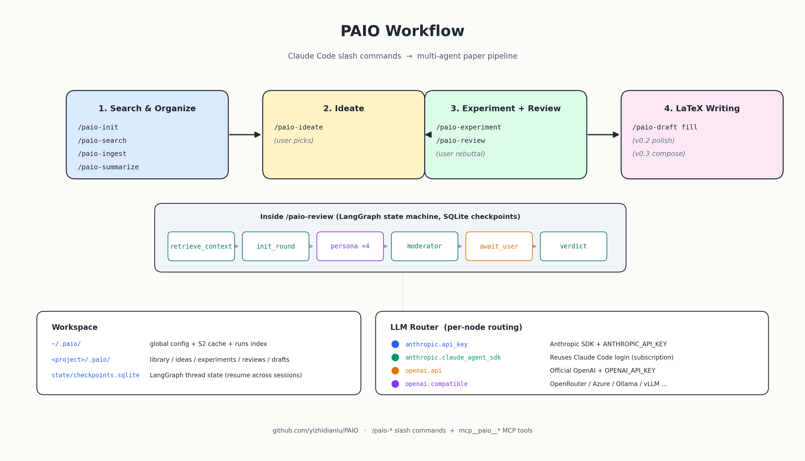

# 端到端工作流

> **Reference** · 每个 `/paic-*` 的调用方式、`.paic/` 产出位置、典型耗时、路由 node、跨会话恢复。

<p align="center">
  
</p>

> Slash command 使用连字符：`/paic-search` ✓ ；`/paic:search` ✗ 。

首次使用先完成 [getting-started.md](getting-started.md)。本文假定 `paic doctor` 全绿。

每步给出：**调用方式** + **`.paic/` 产出位置** + **典型耗时** + **路由 node**。

> 本文描述常规 9 步主链。Paper-quality 高级阶段（paper_plan / claims / paragraph compose / clusters / revisions / quality gate）见 [paper-plan.md](paper-plan.md) 与 [quality-gate.md](quality-gate.md)，并在文末「Paper-quality 高级阶段」节有简表。

---

## 1. `/paic-init` — 建项目

```text
/paic-init 方向：long-context attention 在医学影像报告生成；目标 NeurIPS 2027。
```

- **产出**：`.paic/project.yaml`（含 title / venue / deadline / related_topics）
- **耗时**：< 1 秒
- **路由**：纯本地 fs，不调 LLM

> Skill 要求当前目录为空或仅含 `.paic/`，避免在已有项目误初始化。

---

## 2. `/paic-search <query>` — 多源检索

```text
/paic-search 近两年 long-context transformer 在长文本摘要 / 医学报告生成的代表性工作。
```

- **来源**：
  - `mcp__arxiv__search_papers` + `mcp__arxiv__semantic_search`（arXiv）
  - `mcp__paic__paic_s2_search`（Semantic Scholar；客户端 0.95 req/s 限速）
- **去重**：DOI / arxiv_id 主键 + 标题 fuzzy（threshold 0.92）
- **强制召回校验**：dedupe 之后、渲染表格之前，SKILL 从 topic + 选用的 query 变体里抽 2-4 个 `core_terms`（英文短语），调 `paic_search_recall_check` 把召回池按 title 命中数分四桶。最终表格分两段渲染（「强相关·标题命中核心词」和「其他召回」），避免长召回池里标题明确含核心词的论文被注意力筛掉。
- **产出**：返回候选表（不落盘；`/paic-ingest` 才入库）
- **耗时**：5–15 秒，取决于 query 复杂度
- **缓存**：S2 响应缓存到 `~/.paic/cache/s2/<sha>.json`，永不过期；绕过缓存传 `force=true`

### 检索词变体

输入为 **broad topic**（1–3 词、纯概念词、含中文）时，Skill 先生成 5–6 个英文检索词变体供选择：

```text
基于「diffusion video」候选 6 个检索词变体（默认 #1）：
  1. diffusion model video generation       (直接)
  2. latent diffusion video synthesis       (技术)
  3. text-to-video diffusion                  (应用)
  4. video diffusion temporal consistency   (痛点)
  5. efficient video diffusion 2024          (近期)
  6. controllable video generation diffusion (邻近)
请选择：回车 = #1；多选 "1,3"；自定义 "custom: foo bar"
```

回车走默认 #1。多选最多 3 个，超过会拖慢 fan-out（3 query × 5 platform × pacing ≈ 22s）。

输入为 **specific query**（4+ 词且含具体方法 / 数据集 / 年份）时，Skill 跳过 variant 步骤，直接作主 query。

> 未设置 S2 key 时自动降到 0.33 req/s 匿名档，多源搜索仍可执行。

---

## 3. `/paic-ingest <ids>` — 入库 + 下载（+ 可选翻译 / Zotero）

```text
ingest 第 1, 3, 7 篇。           # 默认：只下载、不翻译
ingest 第 1, 3, 7 篇 帮我翻译     # 加任一关键词「翻译/译/中文/translate」→ 触发 opt-in 中文翻译
```

- **元数据**：写入 `.paic/library/selected.yaml`（PaperRef）
- **本地存档**：`.paic/library/pdfs/<display_basename>.<ext>`，命名格式 `NNN_<title_slug>`（如 `001_attention_is_all_you_need.md`）——3 位库内累积序号 + `_` + 标题转 slug（非字母数字 → `_`、最多 150 字符）。文件名按人类可读优化，与 BibTeX `\cite{KEY}` 用的 `cite_key`（`arxiv_2401_12345` / `doi_10_1234_abc` 等）解耦；`pdf_local_path` 字段写回 `selected.yaml`，下游 summarize / draft 优先读它，没有再回退到 `<cite_key>.<ext>`（兼容老库）
- **平台路由**：
  - **arXiv**：双下载——(a) `mcp__arxiv__download_paper` 拿 markdown 写到上游 storage，`paic_library_attach_paper` 复制成 `<display_basename>.md`；(b) urllib 直接拉 `https://arxiv.org/pdf/<id>.pdf` 落到 `<display_basename>.pdf`（供阅读 / 引用，summarize 链路仍以 markdown 为主）。两次下载之间各 pace 一次（arxiv.org 1 req/3s 限流按调用计数）
  - **paper-search-mcp 平台**（pubmed / biorxiv / medrxiv / pmc / openalex / crossref / ieee / acm，需 `external_search.enabled=true`）：直连或 `download_with_fallback`（Unpaywall / Crossref / OA repo 等），落到 `<display_basename>.<ext>`
  - **DOI 前缀 prefilter**：订阅墙黑名单（`10.1088` IOP / `10.1109` IEEE / `10.1016` Elsevier / `10.1002` Wiley / `10.1007` Springer 等）跳过 fallback 直接入未下载列表（命中率近 0、且 europepmc fallback 会 silent 返回错论文 PDF）
  - **不可下载**（s2 / google_scholar / ssrn / iacr / 缺 UNPAYWALL_EMAIL）：跳过下载、仅入库元数据；摘要标注 `未下载: N 篇（原因）`
- **去重**：按 arxiv_id / DOI 与 `selected.yaml` 校验，重复条目计入 `skipped_duplicates`；同一篇重 ingest 时 attach 看到 dest 已存在 silent 跳过、但仍回写 `pdf_local_path`
- **europepmc 内容校验**：fallback 路径下载的 PDF 走 page-1 三信号校验（作者姓氏 + 标题词命中率 + 字符串相似度）；任一信号不满足 → 列清单**询问用户**后才删（不擅自批量删）
- **节流**：arxiv 默认 6s pace；paper-search-mcp 各平台 per-platform pace；429 自动 `paic_*_pace(seconds=20)` 重试，连续 3 次由用户决定 skip / 调高 pace
- **opt-in 中文翻译**（用户原话含「翻译/译/中文/translate」或加 `--translate`）：主对话**不**逐篇翻译，而是**一次性委派**给后台 `Agent(subagent_type="general-purpose", run_in_background=true)`——主对话拿到 ingest summary 后立刻空闲、可继续跑别的命令；后台 subagent 串行调 `arxiv-translator` skill（latex.ytotech.com 单 session，不能并行），完成时自动通知。产物 `<display_basename>_zh.pdf`。**仅对 arxiv 论文有效**（其它平台无 LaTeX 源码）。需要先把 arxiv-translator skill 装到 `~/.claude/skills/`，未装则整段跳过
- **opt-in Zotero 同步**：检测到 zotero-mcp 注册时询问用户是否同步本批；同步走 DOI / arXiv URL 两条路径（priority 1/2），写入 collection `paic-ingest-<YYYYMMDD>`。详见 [zotero-sync.md](zotero-sync.md)
- **耗时**：每篇 5–30 秒（网络 + 转换）；17 篇 arXiv 默认 ~102s。翻译耗时**不计入主流程**（后台跑），单篇 60–180s

---

## 4. `/paic-summarize [id|all]` — 结构化摘要

```text
/paic-summarize all
```

- **读取（4 级 fallback）**：(1) `paper_text=` 旁路；(2) 上游 arxiv markdown（仅 arxiv）；(3) `<project>/.paic/library/pdfs/<pdf_local_path>`（ingest 时写入 `selected.yaml` 的字段，新库为 `<display_basename>.<ext>` 即 `NNN_title` 格式；老库回退到 `<cite_key>.<ext>` 兼容路径）；(4) 同位置的 `.pdf` + pypdf 提取（命中 `~/.paic/cache/pdf_text/<sha>.txt` 永久缓存）。响应 `text_source` 字段表示生效路径
- **平台覆盖**：arXiv 走 (2)；PubMed / bioRxiv / OpenAlex / Crossref 等走 (4)
- **写入**：`.paic/library/summaries/<paper_id>.md`
- **结构**：problem / method / key_results / limitations / techniques / relevance_to_project
- **路由 node**：`summarize`（按 `routing.default` 或 `routing.overrides.summarize`）
- **耗时**：每篇 30–60 秒（API / SDK 模式）；host 模式由主对话生成，延迟与当前会话一致；首次 PDF 提取额外 ~0.5s/篇（之后命中缓存）
- **PDF 失败模式**：响应中 `pdf_extraction_failed_reason` 给出原因——`encrypted`（用 `qpdf --decrypt`）/ `empty_extraction`（扫描版，建议 `ocrmypdf`）/ `corrupt`（重新 ingest）
- **退路**：4 级 fallback 全失败时，调 `mcp__arxiv__read_paper` 取文本传入 `paper_text=` 参数
- **Host orchestration**：`routing.overrides.summarize: host` 时 PAI-C 不发 LLM 调用——`paic_summarize_run` 返回 `mode: host_orchestration` + 论文 markdown + JSON schema，Skill 让主对话生成结构化字段后调 `paic_summarize_persist` 写盘。详见 [configuration.md → Host Orchestration](configuration.md#host-orchestration订阅复用零外部-llm-调用)

---

## 5. `/paic-ideate [focus]` — 生成 idea（含用户筛选）

```text
/paic-ideate focus 在 "如何不堆 KV cache 扩到 200k token"，给出 8 个 idea。
```

工作机制：

1. 后台启动 LangGraph run（fire-and-poll），状态写入 `.paic/state/checkpoints.sqlite`
2. 头脑风暴节点拉取所有 `summaries/*.md` 作为 grounding，产生 N 张候选 IdeaCard
3. **暂停**等待用户筛选——Claude 列出预览卡询问保留哪几条
4. 用户回复 "保留 1, 4, 7"，graph 继续，写入 `.paic/ideas/<idea_id>.yaml`

- **路由 node**：`ideate_brainstorm` + `idea_score_{methodology,novelty,impact,reviewer2}`（4-persona panel）
- **跨会话恢复**：暂停在用户筛选这步，关闭 Claude Code 后下次 `/paic-resume` 续跑
- **耗时**：脑暴 1–3 分钟；筛选后 finalize ~10 秒

> IdeaCard 含 `feasibility / novelty / impact` 三维评分 + `composite_score`。

---

## 6. `/paic-experiment <idea_id>` — 实验方案

```text
/paic-experiment 选评分最高的 idea，约束：单张 A6000、3 周内完成。
```

- **写入**：`.paic/experiments/<exp_id>.yaml`
- **结构**：research_questions / hypotheses / datasets / baselines / proposed_method（含伪代码）/ metrics / ablations / compute_budget / success_criteria / threats_to_validity / timeline_weeks
- **路由 node**：`experiment_design`
- **耗时**：1–2 分钟，无 interrupt

---

## 7. `/paic-review <experiment_id>` — 4-persona 多轮评审

```text
/paic-review 跑 2 轮 4-persona 评审。
```

最长的一步——4 persona × N 轮 + moderator + verdict。

| 角色 | 职责 | node 标签 |
|---|---|---|
| methodology | 方法论严谨性 | `review_persona_methodology` |
| statistics | 统计 + 数据 + reproducibility | `review_persona_statistics` |
| domain | 领域 fit 与文献定位 | `review_persona_domain` |
| reviewer2 | 创新性 + 红队视角 | `review_persona_reviewer2` |
| moderator | 综合 4 个 critique 出 issue list | `review_moderator` |
| verdict | 终判 accept/major/minor/reject | `review_verdict` |

工作机制：

1. `retrieve_context` 拉取 5–10 篇相关 summary 进入上下文
2. 每轮：4 persona 串行 critique → moderator 综合 → **暂停等用户 rebuttal**
3. 用户提交 rebuttal（"针对 issue #1 加入 LongBench baseline；issue #2 同意将 seed 提到 5"）
4. `apply_rebuttal` 更新 experiment / rebuttals → `decide_next_round`
5. 跑完 `max_rounds` 或 issue 全部 resolved → `verdict`

- **产出**：`.paic/reviews/<exp_id>/{transcript.yaml, round_1.md, ..., verdict.yaml}`
- **耗时**：每轮 4–8 分钟（4 persona × 1–2 分钟）。graph state 落盘，关闭 Claude Code 不影响恢复

> 不同 persona 路由到不同 LLM（如 reviewer2 用 Opus、其余用便宜模型）：见 [configuration.md → 路由 overrides](configuration.md#路由-routing)。

---

## 8. `/paic-draft <stage>` — LaTeX 三阶写作

### 8.1 fill — 模板填充（v0.1）

```text
/paic-draft fill 用 NeurIPS 模板，基于刚 verdict 的 idea + experiment 起骨架。
```

- **模板**：内置 `cvpr` / `neurips` / `ieee`（jinja2 模板在 `src/paic/latex/templates/`）；项目本地自定义模板在 `<project>/.paic/templates/<name>/`，详见 [custom-templates.md](custom-templates.md)
- **写入**：`.paic/drafts/main.tex` + `.paic/drafts/sections/0X_*.tex` + `refs.bib` + 模板自带的 `.sty / .cls / .bst / figures` 自动拷贝
- **填充范围**：title / abstract（一句话 motivation）/ introduction（contributions 列表）/ method 框架 / experiment setup / 占位 results 段
- **scaffold 新 venue**：`paic_draft_scaffold(name="iclr2026", base="neurips")` 派生起点，再替换 `\usepackage{...}` 与拖入 venue `.sty`
- **不做**：v0.1 不跑编译、不写完整段落（v0.2 polish + v0.3 compose 负责）
- **耗时**：5–15 秒（纯模板渲染，不调 LLM）

### 8.2 polish — 段落级 LLM 重写（v0.2）

```text
/paic-draft polish 01_intro --mode tighten
/paic-draft polish 03_method --mode expand     # 把 fill 留下的 TODO 占位扩写完整
/paic-draft polish 02_related --mode formalize --instruction "用第三人称"
```

- **5 模式**：`tighten` / `clarify` / `formalize` / `expand` / `proofread`；可附 `instruction` 自由指令
- **写盘 + 备份**：覆盖原文件，旁置 `<section>.tex.bak.<UTC>`
- **结构 guard**：保留所有 `\cite{}` 键、不引入新 cite key、`\begin/\end` 配对、大括号配对——任一未通过返回 `latex_validation_failed` 不写盘
- **expand 模式**：要求 `idea_id`（或 Skill 自动从最新 idea 推断），将 idea / experiment yaml 注入 prompt
- **dry_run**：`--dry-run` 仅输出 diff
- **路由 node**：`draft_polish`；支持 `routing.overrides.draft_polish: host`

### 8.3 compose — 整段生成 + 引用对齐（v0.3）

```text
/paic-draft compose 02_related --mode from_stub
/paic-draft compose 01_intro --mode from_scratch --target-words 800
```

- **2 模式**：`from_stub`（默认，将当前文件作为 outline 扩写）、`from_scratch`（从 idea + library 重新生成，忽略当前文件）
- **引用对齐**：将 `library/selected.yaml`（cap 40 篇）每篇的 `[cite_key] title (author, year) — 一句概括` 注入 prompt，LLM 仅从该 whitelist 选择 cite。**所有** `\cite{KEY}` 必须存在于 library，否则返回 `latex_validation_failed` 不写盘
- **section-aware 长度建议**：intro 800 / related 700 / method 900 / experiments 800 / conclusion 220 / abstract 200（用户传 `target_words` 覆盖）
- **写盘 + 备份**：与 polish 同
- **错误恢复**：guard 列出 `cite_keys_missing_from_library`——ingest 缺失论文后重试，或换 mode
- **路由 node**：`draft_compose`；支持 `routing.overrides.draft_compose: host`

**典型流程**：fill → compose（写出含真实引用的段落）→ polish（细调措辞）。

`compose` 还有第 3 模式 `paragraph`（outline → write → polish 三步），适合长 section（intro / related / experiments），需 `paper_plan + claims` 齐全。详见 [paper-plan.md § 4](paper-plan.md)。

---

## 9. `/paic-figure <stage>` — 论文配图（raster）

启用前置：`providers.images.enabled: true`，详见 [configuration.md → images](configuration.md#images-paic-figure)。

### 9.1 plan — 提议图位

```text
/paic-figure plan
```

- **读取**：传入 `draft_path=` 时优先读 polished `.tex`；否则回退到 `idea + experiment` YAML
- **产出**：`.paic/figures/_plan.yaml`，含 ≤4 个 slot（`teaser` / `concept` / `domain`），每条带 `section_hint` / `position_hint` / `scene_description` / `caption_hint` / `rationale`
- **路由 node**：`figure_plan`
- **耗时**：10–20 秒（1 次 LLM 调用，无图像 API 成本）

### 9.2 generate — 渲染图片

```text
/paic-figure generate teaser
```

- **流程**：合成 academic-style 图像 prompt（节点 `figure_prompt`）→ 调用图像 API → 写入 `.paic/figures/<slot>/v1.png` + `meta.yaml`
- **返回**：`png_path` + `image_prompt` + 即用的 `\begin{figure}...\includegraphics{figures/<slot>/v1.png}...\end{figure}` 片段
- **耗时**：10–30 秒/张（视后端）；gpt-image-1 在 `quality=high` 下约 ¥0.5–2/张（中转站）

### 9.3 edit / variant — 改图

```text
/paic-figure edit teaser "调暗整体色调，增加海洋元素"
/paic-figure variant teaser n=2
```

- `edit` 基于最新版微调，写入 `v<n>_edit.png`，meta 记录 `parent_version`
- `variant` 基于最新版生成 N 个备选，写入 `v<n>_variant.png`
- gpt-image-1 无 native variations，`variant` 走 `edit` + "alternative variation" 提示模拟
- 多次 edit 会偏移；建议每 slot 至多 edit 2 次，不满意则修改 `scene_description` 重新 generate

### 范围限制

- **不适合**：架构图（boxes + arrows + 标签）、定量结果图（曲线 / 柱状图）、含精确文字的图表
- **替代方案**：架构图用 TikZ；结果图用 matplotlib + 真实实验数据

---

## 跨会话恢复

下次启动 Claude Code，第一句：

```text
/paic-resume
```

列出 paused / awaiting_input 的 run。继续指定 run：

```text
/paic-resume 01HX8K... rebuttal："针对 issue #1，..."
```

底层调用 `mcp__paic__paic_runs_resume`，从 `.paic/state/checkpoints.sqlite` 取 thread state 续跑。

---

## 状态查看

```text
/paic-status
```

输出：项目元信息、library / ideas / experiments / reviews 计数、当前活跃 LangGraph run。

---

## Paper-quality 高级阶段

主链 9 步之外，PAI-C 提供一组 opt-in **paper-quality** 工具把「散点式生成 → 一致性论文」串起来。完整教程见 [paper-plan.md](paper-plan.md) 与 [quality-gate.md](quality-gate.md)；以下是简表。

| 工具 / 命令 | 作用 | 文档 |
|---|---|---|
| `/paic-paper-plan` | 生成 / 更新 `paper_plan.yaml`：thesis、contributions、section_plan、terminology、symbols | [paper-plan.md § 1](paper-plan.md) |
| `paic_claims_init` / `_extract` / `_validate` | 强声明 ledger（compose / polish 自动 extract；validate 跨 claim 检查支持） | [paper-plan.md § 2](paper-plan.md) |
| `paic_library_retrieve` | BM25 + MMR section-aware 检索；library > 40 篇时 compose 自动启用 | [paper-plan.md § 3](paper-plan.md) |
| `/paic-draft compose --mode paragraph` | outline → write → polish 三步 pipeline，长 section 一致性更好 | [paper-plan.md § 4](paper-plan.md) |
| `paic_related_work_cluster` | library 分 3-5 群；`compose 02_related` 自动一群一段 + contrast | [paper-plan.md § 5](paper-plan.md) |
| `paic_revision_extract` / `_list` / `_apply` / `_resolve` | review 评论转 RevisionTask，跨轮跟踪 | [paper-plan.md § 6](paper-plan.md) |
| `paic_figure_plan`（claim 绑定增强） | 每个 contribution 必须有图 / 表 / 算法绑定或 `no_visual_reason` | [paper-plan.md § 5](paper-plan.md) |
| `/paic-finalize` | 提交前 8 类 paper-level 检查 + overrides | [quality-gate.md](quality-gate.md) |

**典型嵌入位置**：`/paic-experiment` 之后跑 `/paic-paper-plan`；`/paic-review` 后调 `paic_revision_extract` 落 task；`/paic-related-work-cluster` 后再 `/paic-draft compose --mode paragraph 02_related`；提交前 `/paic-finalize`。

---

## 端到端串接

```text
方向：transformer 在脑电信号自动诊断。请按 init → search → ingest → summarize
→ ideate → experiment → paper-plan → review → draft fill → compose paragraph
→ figure plan → finalize 串起来，每个用户 checkpoint 暂停等我。
```

Claude 自行按顺序串接 skill。
